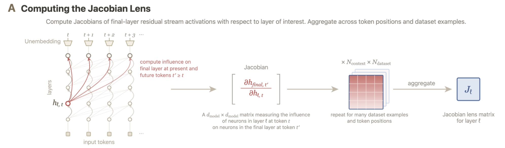
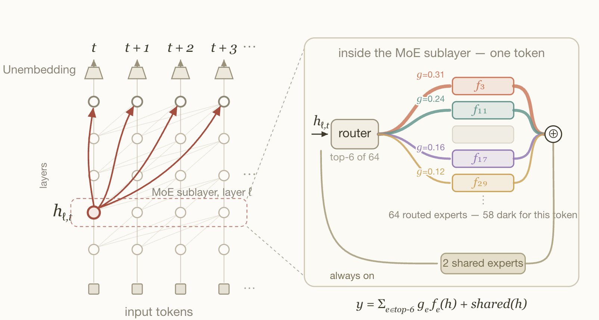
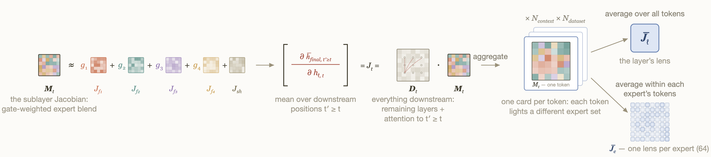
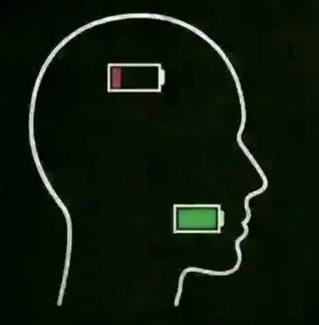
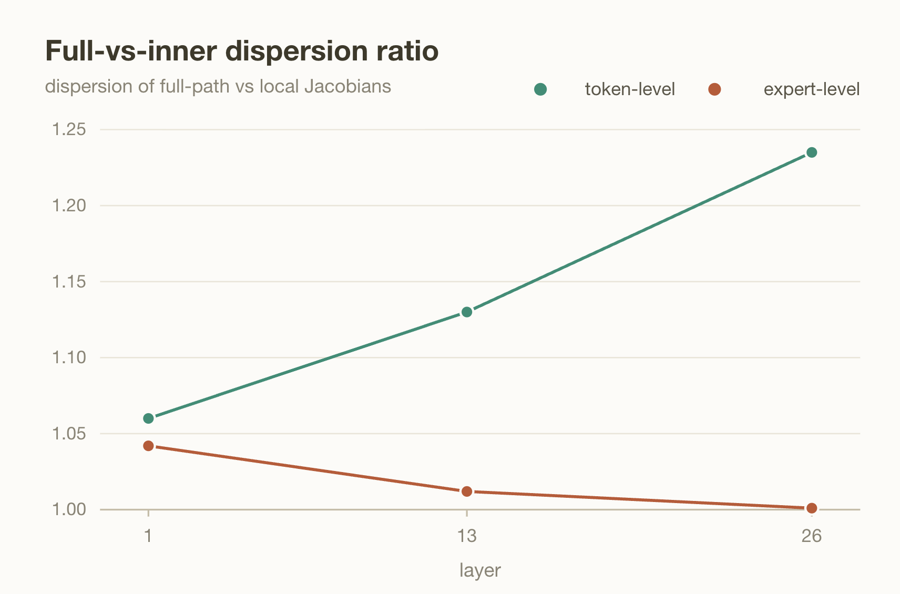
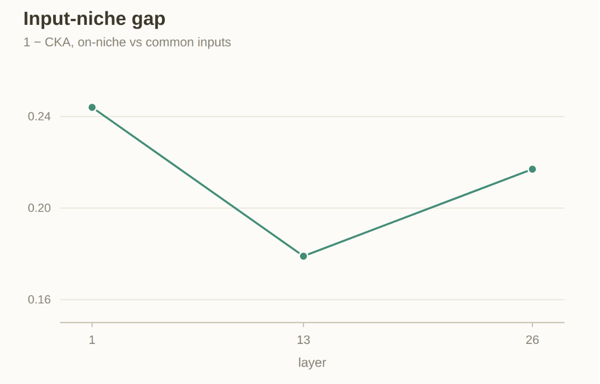
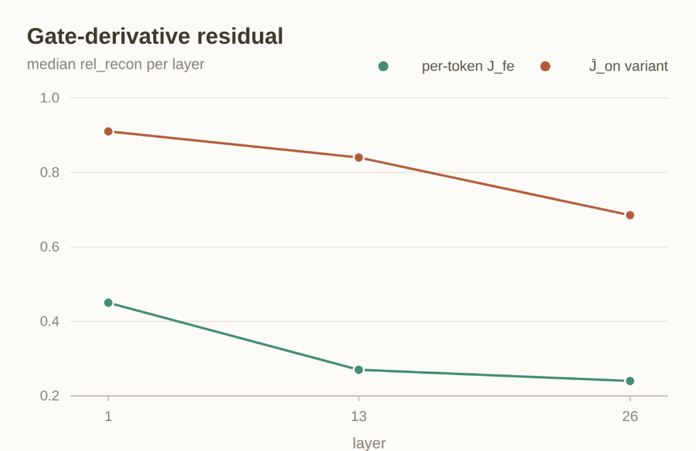
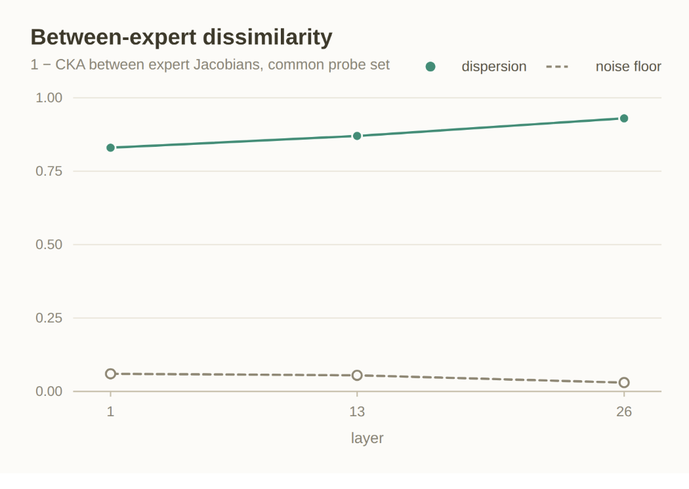
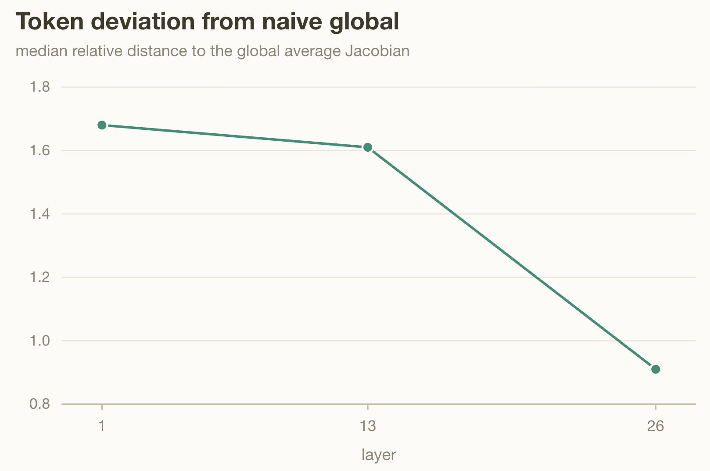

# Investigating the J-Lens in Mixture-of-Experts Models

## 1. Introduction

In July, Anthropic provided evidence that Claude has "access consciousness". WE are doomed. 

Anyway, in this work they use a new mechanistic interpretability technique called the Jacobian lens to identify a "global workspace", a space where the model "maintains a privileged set of internal representations, available for report, modulation, and flexible internal reasoning, atop a much larger volume of automatic processing". The full paper is here: [Verbalizable Representations Form a Global Workspace in Language Models](https://transformer-circuits.pub/2026/workspace/index.html) 

The point of the J-lens is to identify what is verbalizable at a given point in the model's computation (at some Layer l, and token position t). Extremely colloquially, we could interpret this as reading the model's mind at a given point in time. Please Anthropic, don't send a death squad after me, I'm just a lowly blogger.

"Ellington, I'm too lazy to read the paper, because I'm a giga chud. What exactly is the J-lens and how is it constructed?"

I'm glad you asked. The J-lens maps the hidden state $h_{l, t}$ to scores $s_{l, t}$ over the vocabulary, characterizing the activation's average first-order causal effect on the model's output logits at the current and subsequent token positions, averaged across contexts. It answers the question: "what is the average causal effect of the hidden state at position $t$ on the future outputs?"

When constructing the lens, remember we want the lens to be general in the sense we can apply it to a variety of contexts, so we average over a diverse corpus of contexts. Within each context, we compute the effect the hidden state at position $t$ has on the future outputs at position $t'$. This effect is captured by the Jacobian matrix $\frac{\partial h_{\text{final}, t'}}{\partial h_{l, t}}$. We average this over all contexts to get the final J-lens.

$$J_{l} = \mathbb{E}_{t, t' \geq t, \text{corpus}}\left[\frac{\partial h_{\text{final}, t'}}{\partial h_{l, t}}\right]$$

<figure class="post-figure" markdown="0">

<figcaption>Figure from Anthropic illustrating computing the J-lens</figcaption>
</figure>

Anthropic did this great work, but why do we care? Well, averaging a Jacobian across positions and prompts is a perfectly sensible thing to do if layer 1 is one function. You're sampling one map at many points and taking the mean. Fine. Whatever. But in Mixture-of-Experts models there may be up to 384 functions per layer. And more problematic still, each token activates some subset of those functions, whose outputs are then combined into the layer's output. Even if only 2 were active at a time, that's more than 70,000 possible combinations per token. It is not at all clear that averaging over this, on top of averaging over tokens and prompts, is valid.

(As an aside, I see the fact this problem was not addressed in the paper as good evidence the models used Opus and Sonnet are dense rather than MoE. I think this is the consensus but they are not open so who knows)

A natural set of questions is: 

- ***Is a naively averaged Jacobian lens valid?***

- ***How much does the averaged J-lens deviate from a MoE aware lens?***

- ***When we have different functions per-token, per-layer, where does this global workspace live?***

- ***The workspace may be regime-local rather than global. is this true?***

- ***Is routing itself workspace-sensitive?*** 

This blog will pertain to the first 2. Future blogs will deal with the last 3. 

## 2. Building a MoE Aware Jacobian

For my experiments, I used DeepSeek-V2-Lite-Chat. This was the largest model I could use with my compute constraints (1 h100).  DeepSeek-V2-Lite-Chat has both an always-on shared-expert pathway and 64 routed experts. 

<figure class="post-figure" markdown="0">

<figcaption>MoE layer</figcaption>
</figure>

My first idea was to build Jacobians conditioned on the top-k routing pattern of layer l. This is a really stupid idea. For a LOT of reasons. Let's assume we have top-6 is a good enough approximation, we now have $\binom{64}{6} = 7 * 10^7$ Jacobians to build, just not possible. On top of that, consider conditioning on a specific routing pattern: This is equivalent to conditioning on the input tokens themselves. Tokens route to combination C precisely because their $h_{l, t} occupies a particular region of activation space. So two pattern-conditional Jacobians can differ even if the experts were byte-identical, just because they see different tokens.

Once I locked in, it became apparent we should build the Jacobians per-expert rather than per top-k pattern. The combinatorial difficulty of this first problem alerted me to another: how do we deal with the routing of future layers. Routing does not just happen at the layer the Jacobian is built for. It happens at each layer.

I don't solve that here. So it's maybe more accurate to call this a partially MoE aware Jacobian. What I do instead is factor it into a decomposition where I can name and study routing aware and the non-routing aware portion separately:

$$J_{\ell,t} = D_t M_{\ell,t}, \qquad M_{\ell,t} = I + \sum_{e \in S_t} g_{t,e} J_{f_e}(h_{\ell,t})$$

$M_{\ell,t}$ is the **inner map**, layer $\ell$'s input to its output, with $I$ the residual skip, $S_t$ the experts this token selected, and $g_{t,e}$ their gate weights. Being MoE aware is built into this map, it considers the per-expert Jacobians at this layer. It's exactly linear in the per-expert Jacobians $J_{f_e}$, which is what makes the whole thing tractable. 

$D_t$ is the **downstream map**: everything after layer $\ell$'s output, including all downstream routing and the position-mixing that attention does across $t' \geq t$. It's computed by autodiff on the real forward pass, so downstream routing isn't approximated away, it's baked in at whatever routing actually fired.

 $J_{\ell,t}$ is the **full path**, it's what actually reaches the output, and it's analogous to the object the original paper's claims are about. The inner map and the per-expert pieces are there to *decompose and attribute* it. I never treat $M_{\ell,t}$ on its own as the workspace, because a difference that's large locally can be damped to nothing by $D_t$, and a small one can be amplified.

Two things fall out of this for free. Firstly, expanding the product splits the Jacobian additively into a residual term, a shared-expert term, and a routed term:

$$J_{\ell,t} = \underbrace{D_t}_{\text{residual}} + \underbrace{\sum_{e \in \text{shared}} g_{t,e} D_t J_{f_e}}_{\text{shared}} + \underbrace{\sum_{e \in S_t^{\text{routed}}} g_{t,e} D_t J_{f_e}}_{\text{routed}}$$

Notice that because of this decomposition we can probe/measure where the workspace lives (at least the broadcast requirement) without having to zero out experts, and work with a broken model. 

Second, I can average each $J_{f_e}$ two ways: $\bar J^{\text{on}}_e$, over the tokens that actually routed to $e$, and $\bar J^{\text{common}}_e$, over a common probe set every expert sees. The gap between those is the input-niche confound I complained about two paragraphs ago. We can now measure it. 

<figure class="post-figure" markdown="0">

<figcaption>Computing the MoE Aware J-lens and Expert Jacobians</figcaption>
</figure>

## 3. Beating away the many Confounds 

OK, so we've done all this set up, where is the climax? (ayo) Is the native Jacobian valid or not? Before we get there, I am going to try to kill off all the confounding variables that may take away from the headline.

### What does it mean for the Jacobian lens to be valid?

It means a native Jacobian lens with no knowledge of the experts aligns with a lens that does have knowledge. Now, you are probably thinking "Ellington, this is stupid. You're stupid. Autodiff differentiates whatever forward pass actually ran including the router and experts, so native J already has the routing baked in. dummy." and you are right but there is a subtlety here. Remember that the Jacobian is computed by taking a mean over the tokens. But, each token is processed by a set of discrete and structurally separate sub-networks. It is entirely possible that a mean over these tokens does not summarize the population accurately and instead is a centroid that lives in no man's land. Imagine the mean of a wide bimodal distribution; it's possible the mean lives in a place no member of the distribution lives. 

<figure class="post-figure" markdown="0">

<figcaption>My reader's opinion of me</figcaption>
</figure>

### First, is our decomposition valid? What is the role of $D_t$? (Confound 1)
Prior to directly measuring the MoE aware and non-MoE aware Jacobians against each other, we need to do a few things. Firstly, is this decomposition I introduced in the above section even valid? I would certainly be suspicious. We only are expert aware at one layer and the downstream is completely blind. In order to test this, I compare the variation in the Jacobians before and after the downstream map is applied. The concern, stated precisely, is that $D_t$ might be routing-dependent in disguise: if the rest of the network responds differently to the output of one expert mix than another, then differences between local maps would be reshaped on their way to the output. And then we have a major confounding factor, that all of layer l's routing mixture structure doesn't actually live exclusively in $M_t$

<figure class="post-figure" markdown="0">

<figcaption>what would happen if D_t was routing dependent</figcaption>
</figure>

In order to test this, I compute the dispersion (measured by pairwise CKA distance) of the inner maps Mₜ and of the corresponding full-path Jacobians Jₜ = Dₜ·Mₜ, and take their ratio: the full-vs-inner dispersion ratio, a downstream amplification factor. If Dₜ is neutral transport, applying it changes nothing about the relative geometry and the ratio sits at 1; a ratio above 1 means the downstream path compounds routing differences, below 1 means it equalizes them.

<figure class="post-figure" markdown="0">

<figcaption>Dispersion</figcaption>
</figure>

 If an expert-blind $D_t$ were distorting the picture, the spread of the full-path Jacobians $J_{\ell,t} = D_t M_{\ell,t}$ would systematically depart from the spread of the inner maps alone. The downstream path would either exaggerate routing differences on their way to the output or wash them out, and in either case the decomposition would be attributing structure to the wrong factor. At the expert level it does neither: the ratio sits at ~1.04 at layer 1 and decays to ~1.00 by layer 26. So, differences between the per-expert averaged maps J̄ₑ arrive at the output essentially unchanged. $D_t$ acts as expert-neutral transport. (Let's go!) All of the routing-dependence lives in Mₜ, where we measure it. The same plot, read at token granularity, is also a great vote of confidence for us. The token-level ratio is above 1 at every probed layer and grows with depth (~1.06 → ~1.24), so per-token differences in the local map are not averaged away downstream: they are mildly amplified. Combined with between-expert dispersion sitting an order of magnitude above the split-half noise floor (seen in figure Between-expert dispersion), this means the naive global $J_l$ is blending linear maps that genuinely differ, and the blend gets less representative of any individual token's path the deeper the layer. The naive average may survive as a coarse summary, but as a per-token object it is shaky.

 ### Are our inputs confounding us? (Confound 2)

 If you remember earlier I mentioned a potential confounding variable while computing Jacobians unique to MoE models, which is each expert sees different sets of tokens. So even if two experts are completely identical, if we were to compute two Jacobians they would be different just as a result of the differing input distributions. 

 In order to measure this confound, I compute 2 Jacobians per expert, $J_{e, on}$ and $J_{e, common}$. $J_{e, on}$ averages the expert's Jacobian over the tokens that got routed to it, and $J_{e, common}$ averages the same expert's Jacobian over a fixed, shared set of inputs that's the same for every expert, whether or not those inputs would normally be sent to it.

 The difference between them separates two things that are otherwise tangled together: what the expert intrinsically computes, versus the particular slice of inputs the router happens to feed it. $J_{e, common}$ isolates the intrinsic behavior (everyone measured on the same inputs), and the gap $ \lVert J_{e, on}$ − $J_{e, common}\rVert$ tells you how much of an expert's behavior is an artifact of its input.

 (I think it is important to note that while I call $J_{e, on}$, $J_{e, common}$ jacobians, they are not a J-lens. Neither $J_{e, on}$, $J_{e, common}$ take layer input to model output, rather they take layer input to layer output through a specific expert)

<figure class="post-figure" markdown="0">

<figcaption>Input Gap</figcaption>
</figure>

The important takeaway from this graph is that the gap is nontrivially large at each measured layer. Input distribution moves each expert so if we want to compare experts' differences we should use a common set of tokens. And, we'll see in a future figure that the CKA gap is smaller than the difference between experts. Meaning the input gap is big enough that we cannot conflate the two averagings, and small enough that expert diversity survives controlling for it, which is the combination that makes the per-expert decomposition we did both necessary and sufficient. Yippeee. 

### The ≈ I've been hiding from you (Confound 3)

You caught me. When I wrote $M_{\ell,t} = I + \sum_{e \in S_t} g_{t,e} J_{f_e}(h_{\ell,t})$ back in section 2, I treated the routing as frozen. But the gate weights $g_{t,e}$ are not constants, they're functions of the same hidden state I'm differentiating with respect to. A proper application of the product rule gives a second term, $\sum_e f_e(h)\, \nabla g_e$: nudging $h_{\ell,t}$ doesn't just change what each expert computes, it also changes how much the router listens to each expert. My decomposition drops that term. oopsie. So the honest equation has an $\approx$ in it. 

"Why did you do this?": Notice that if we differentiate the sublayer honestly we have a term $f_e(h)\nabla g_e$. This is a very problematic term $\nabla g_e$ involves every expert implicitly because the router scores experts competitively, so we run into the combinatorial sampling problem we ran into without top-k routing pattern. AAARGHGHGH!

Yeah Yeah this sucks. The good news is I never have to hand-wave about how big the dropped term is, because it is directly measurable. Autodiff gives me the true full-path Jacobian $J_{\ell,t}$, and I can separately reconstruct $$D_t M^{\text{recon}}_{\ell,t}$$ from the per-expert pieces and the logged gates, which contains everything *except* the gate-derivative term. Their disagreement, $$\lVert J_{\ell,t} - D_t M^{\text{recon}}_{\ell,t}\rVert / \lVert J_{\ell,t}\rVert$$, *is* the dropped term.

<figure class="post-figure" markdown="0">

<figcaption>Gate-derivative residual (median relative reconstruction error)</figcaption>
</figure>

The bottom curve reconstructs each token's map from its *own* per-token expert Jacobians $J_{f_e}(h_{\ell,t})$. The residual starts around ~0.45 at layer 1 and falls to ~0.24 by layer 26: the routing-frozen approximation is rough early, the router's sensitivity to the hidden state is a real part of the layer-1 Jacobian, but it captures the large majority of the map at depth, where routing has apparently settled down.

The top curve is a little scary. Reconstruct the same tokens using the averaged $\bar J^{\text{on}}_e$ instead of the per-token expert Jacobians and the residual balloons to ~0.91 at layer 1, still ~0.69 at layer 26. Read that carefully, because it's a trap I want you to avoid: the per-expert averages are *population* objects. They're the right tool for asking what expert 41 does on average, how different the experts are from each other, where the shared pathway sits. BUT BUT BUT, they are not per-token predictors, you cannot look up a token's six experts, grab six averaged matrices off the shelf, blend them with the gates, and expect to recover *that token's* map. The expert nonlinearities move too much with their inputs for the shelf copy to stand in for the local one.

"Wait, Ellington, if reconstructing from averages is ~90% wrong, isn't your whole validity analysis built on sand?" No, because nothing in it routes through that reconstruction. Every result here compares like with like: the token-deviation and token-level dispersion results use per-token Jacobians measured directly by autodiff on each token's real forward pass, no $\bar J_e$ anywhere in that pipeline, while the between-expert dispersion, the niche gap, and the expert-level ratio are population claims about population objects, which is exactly what averages are for. The ~0.9 residual kills a shortcut I never took: blending shelf-averaged expert matrices to fake a token's map. The reason I address it is because the previous sections read as if I use this shortcut.

If anything, the top curve is evidence *for* the thesis. My worry was that a mean over a population can be a centroid where no member lives. The $\bar J^{\text{on}}_e$ curve is that same phenomenon one level down: even within a single expert, the average Jacobian is a poor stand-in for any particular token's copy. The bimodal-distribution picture from earlier applies here. Averages are population summaries all the way down, and "fine as a summary, shaky as a per-token object" turns out to be true of experts for exactly the reason it's true of the layer.

That was a lot of text so here's a picture of my cat 
<figure class="post-figure" markdown="0">

<figcaption>My cat, Quinn</figcaption>
</figure>

## 4. Is the averaged naive Jacobian valid and how much does it deviate from a MoE aware one?

Alright, is the naive averaged J-lens actually summarizing anything, or is it the centroid-in-no-man's-land?

First things first: are the experts even different functions? Yes, I know this has an obvious answer but it's good to cover all your bases. Here is the between-expert dispersion, measured as pairwise 1 − CKA on the *common* probe set (remember, common set, so the input-niche confound from earlier is already controlled out of this figure. Two experts differ here only if they compute different maps.)

<figure class="post-figure" markdown="0">

<figcaption>Between-expert dispersion vs the split-half noise floor</figcaption>
</figure>

The dispersion sits at ~0.83 at layer 1 and *climbs* to ~0.93 by layer 26, against a split-half noise floor of ~0.03–0.06. It is an order of magnitude above the floor, on inputs every expert shared, after controlling for the niche confound. Captain obvious has spoken: a DeepSeek MoE layer is not one function with 64 flavors, it is 64 different linear-response behaviors that the router blends per token. 

OK, so the population is diverse. But diverse populations can still have useful means. How far does the naive global $J_\ell$ actually sit from the map any individual token experiences? This is the deviation question,

<figure class="post-figure" markdown="0">

<figcaption>Median relative distance from each token's Jacobian to the naive global</figcaption>
</figure>

The median token's Jacobian sits at relative distance ~1.7 from the naive global at layer 1, ~1.6 at layer 13, and ~0.9 at layer 26. Let me spell out how brutal that is: a relative distance of 1.7 means the gap between a typical token's map and the "average" map is bigger than the map itself. ***FAHHHHHHHH***. The naive lens is a different object that no token experiences. Even at layer 26, the friendliest layer for the naive average, the typical token still disagrees with it by ~90% of its own norm. The centroid really does live in no man's land.

**Is the naive Jacobian valid?** As a population-level summary, "what does this layer do to the residual stream, on average, over this corpus", yes, it's a well-defined, reproducible object, and nothing here says you can't compute it. As a *per-token* object, "what is this token's mind doing right now", which is the mind-reading register the J-lens invites, no. Not close. It's like Tony Snell vs the Jazz on 2/24/17. **How much does it deviate from an MoE-aware one?** By more than its own size at early and mid layers, shrinking to roughly its own size by the end. If you want the lens the token actually looked through, you need the MoE-aware machinery: the per-token $J_{\ell,t} = D_t M_{\ell,t}$. The naive average is a photograph of the whole crowd; nobody in the crowd looks like the photograph.

## 5. Conclusion and Future work that I'll probably forget to do.

The decomposition $J_{\ell,t} = D_t M_{\ell,t}$ holds up: $D_t$ carries expert differences to the output without editing them, the input-niche and gate-derivative confounds are measured rather than assumed away, and the one shortcut that fails (rebuilding per-token maps from averaged experts) is a shortcut nothing here relied on. And the verdict on the naive J-lens: fine as a corpus-level summary, invalid as a per-token object, the typical token's map sits further from the "average" than the average is big. If you point a naive J-lens at an MoE model and call it mind reading, you're reading a mind nobody has.

What's next, allegedly. The two questions I punted on: is the workspace *regime-local* — do routing clusters carry their own dictionaries, with $D_t$'s routing-dependence doing real work (the per-token routing-vs-null gap opening at layer 26 is the breadcrumb here) — and is the *router itself* workspace-sensitive, i.e. do J-space-aligned tokens get preferentially routed to high-gain experts? Nearer term: the shared-vs-routed additive split to localize where the broadcast lives, more than three probed layers, and actually differentiating through the gate weights instead of invoicing them as a residual. Also, qualitative inspection of the MoE aware J-lens. If you don't hear from me, assume the H100 queue won.

---

If you have any questions or comments, please feel free to reach out to me on [LinkedIn](https://www.linkedin.com/in/ellingtonhemphill/) or email me at [ehemp@mit.edu or hemphilled@icloud.com](mailto:hemphilled@icloud.com;ehemp@mit.edu;).

---

## 6. Disclaimer 

This is not full-fledged research. The takeaways in this blog should be read as weak to moderate evidence of the claims made. Not certainty.

## 7. Appendix

I had claude write this entirely. 

A. Making the MoE path differentiable

The stock DeepSeek-V2 modeling code routes tokens through moe_infer during evaluation. That function is decorated with @torch.no_grad and uses numpy-based scatter operations, so no gradient flows through the expert computation at all: calling backward() on the unmodified model silently differentiates a graph that does not contain the experts. All Jacobians in this post are computed against a patched forward that (1) runs the router gate as normal, obtaining top-6 indices and gate weights per token; (2) loops over the experts explicitly, computing each active expert's unweighted output f_e(h) inside the autograd graph; and (3) recombines exactly as the stock path does: y = \sum_e g_e f_e(h) + \text{shared}(h). The patched forward is numerically identical to the stock forward (verified in fp32).

The patch exposes three modes. differentiable enables the gradient path with no recording and is used for all Jacobian passes. capture additionally records per-expert outputs, gate weights, and the full 64-way router logits per token, and is used for reconstruction checks and routing tables. record_routing hooks only the gate on the fast path and is used for corpus-scale occupancy statistics.

B. Random-probe sketching

A dense d \times d Jacobian at d = 2048 requires 2048 backward passes (VJPs) through the full model per token, which is infeasible at corpus scale on the available hardware, and torch.func.jacrev applied to the full model exceeds memory (~79 GB peak regardless of chunking). Instead, all full-path objects are estimated as sketches. A single Gaussian probe matrix P \in \mathbb{R}^{128 \times 2048} is generated once (seed 0, CPU) and reused for every token, layer, and run. The sketch S = PJ is computed as 128 VJPs: row j is the gradient of \langle P_j, F \rangle with respect to the leaf. One forward graph is built and reused via retain_graph across all 128 rows, keeping peak memory at the single-VJP floor (~33 GB, of which ~31 GB is bf16 weights).

Two properties make sketches sufficient for every analysis in the post. First, because P is shared, all sketches live in the same coordinates, so they can be averaged and compared directly: \text{mean}_t(P J_t) = P\, \text{mean}_t(J_t). Second, the chain identity survives projection: PJ = (PD)\,M. Every validity check therefore holds on sketches unchanged in form.

C. Choice of target functional

The target functional is F = \text{mean}_{t' \geq t}\, h_{\text{final}, t'}, the final hidden state averaged over all positions from t to the end of the 256-token sequence. Because VJPs are linear, seeding a single cotangent with this average returns the position-averaged Jacobian in one backward pass; the averaging is free.

An earlier version pinned a single target position t' = 255. This produced per-token Jacobians that were mutually orthogonal (median pairwise cosine similarity 0.001), because a fixed distant target drops the vertical residual-stream path at t' = t and retains only the attention-mediated component, which varies essentially independently across tokens. The averaged target is what all reported results use.

D. Per-token pipeline

For each sketch token at a probed layer, the pipeline runs five steps: (1) a plain pass (no grad, differentiable path enabled) recording the true sublayer input s_0 and output o_0 at (\ell, t), plus the top-6 expert indices and gate weights; (2) the exact local map M_{\ell,t} via jacrev of the MoE sublayer alone at s_0 (cheap, one sublayer); (3) the reconstruction M^{\text{recon}}_{\ell,t} = \sum_e g_e\, J_{f_e}(s_0) + J_{\text{shared}}(s_0), with each expert cast to fp32; (4) J_s = PJ, computed by injecting a grad-requiring leaf at the sublayer input via a forward-pre-hook and running 128 retained-graph VJPs from the averaged target; (5) D_s = PD, identical but with the leaf injected at the sublayer output via a forward hook.

Each token is stored with two residuals. The chain residual \lVert J_s - D_s M_{\ell,t} \rVert / \lVert J_s \rVert is a plumbing check on the exact identity J = DM; its median must be below 5 \times 10^{-2} for the layer to pass. The reconstruction residual \lVert J_s - D_s M^{\text{recon}}_{\ell,t} \rVert / \lVert J_s \rVert is the gate-derivative term discussed in the main text, logged as a measurement rather than gated.

E. Sampling and per-expert estimation

Per-token sketches use 128 tokens per layer, drawn one per sequence at mid-sequence positions 64–191 of 256-token sequences, spread over the corpus. Probed layers are 1, 13, and 26 (early / mid / last); layer 0 of DeepSeek-V2-Lite is a dense MLP and is excluded. Gate weights are used as the model produces them (DeepSeek-V2-Lite does not renormalize the top-6 weights).

Per-expert averaged Jacobians \bar J_e are computed for all 64 routed experts at each probed layer by jacrev on the expert FFN alone in fp32 — no full-model backward is involved. Each expert is averaged two ways: over up to 500 tokens the router actually sent to it (\bar J^{\text{on}}_e) and over a common probe set of 500 tokens identical for every expert (\bar J^{\text{common}}_e). Every average carries interleaved even/odd split-halves, whose disagreement serves as the calibrated noise floor. The shared-expert module receives the same treatment.

F. Metric definitions

Similarity between Jacobians is measured with linear CKA computed on Gram matrices J^\top J. This choice is deliberate: CKA on J^\top J is invariant to left-orthogonal transformations, which is exactly the slot occupied by the shared probe P, so sketched and dense objects are comparable on the same footing. Dispersion of a set of Jacobians is the mean pairwise 1 - \text{CKA} across the set. The routing-grouped null is constructed by repeatedly partitioning the same tokens into random groups with sizes matched to the routing-defined groups and computing the identical statistic; the reported null is the mean over repetitions.

G. Cost

Each token costs roughly 50–60 seconds, dominated by the two 128-VJP sketches. One layer runs per SLURM job on a single H100; results are written token-by-token as atomically renamed tok*.pt files, so jobs are resumable after preemption. Peak memory is ~33 GB.

H. Limitations

Three probed layers out of 26; 128 sketch tokens per layer; sketch width K = 128 out of d = 2048. The gate-derivative term is measured as a residual, not modeled. All corpus-level quantities are defined relative to the specific pretraining-style mixture used here; per-expert averages inherit the routing distribution of that corpus. Conclusions are for DeepSeek-V2-Lite-Chat and may not transfer to other MoE architectures, in particular those with different top-k, gate normalization, or shared-expert configurations.

