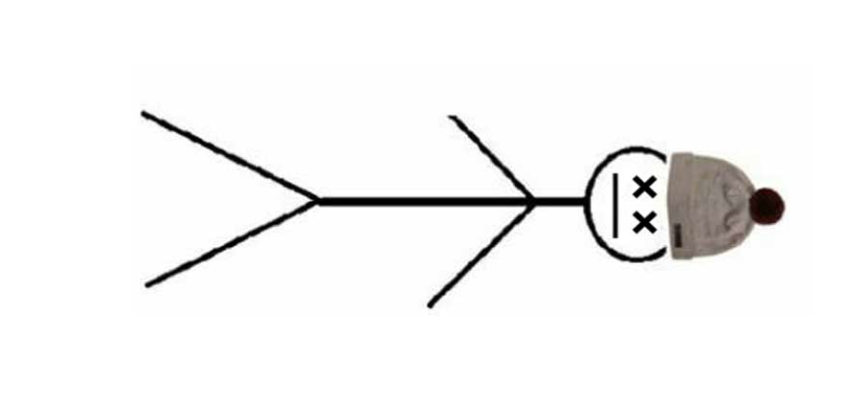
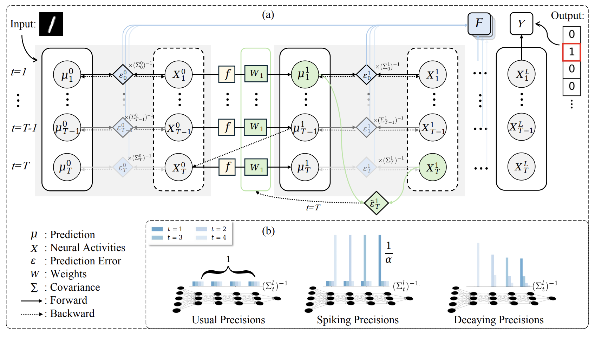
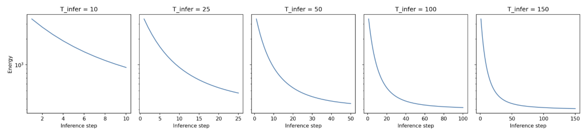
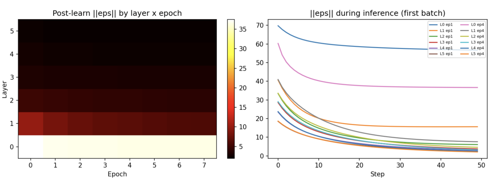
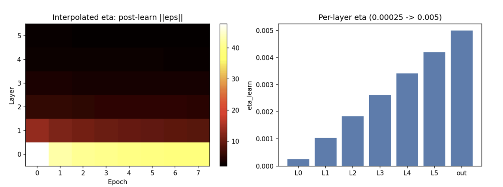
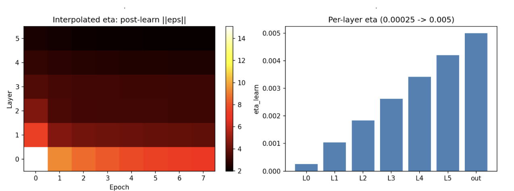
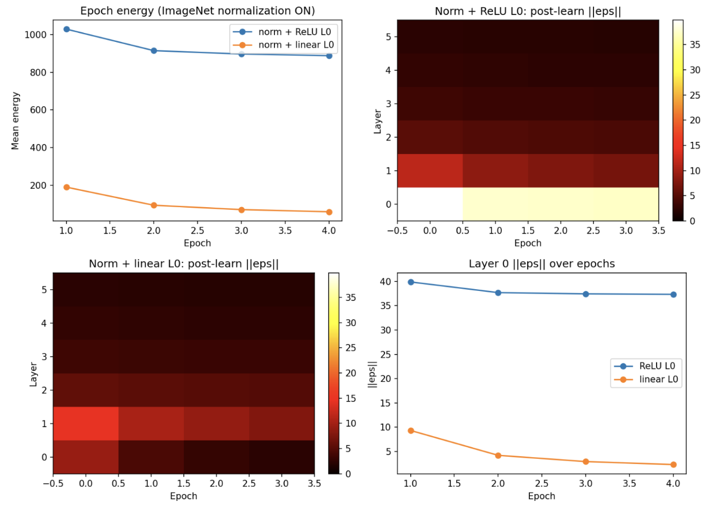

# Road to Predictive Coding Language Models: Predictive Coding Networks

## 1. Backprop = BLEH.

The central problem at the core of machine learning is credit assignment. If we want to iteratively improve an output, we must quantify how the parameters of our model contribute to producing said output. Then, update our parameters to produce better outputs based on how they contribute. The canonical solution to this problem is backpropagation. We attach a function on the output space that: 
    1. is parameterized by our models parameters
    2. provides insight into how correct any given output is

Once we have this loss function, credit assignment becomes easy. We just compute the gradient of the function with respect to the model parameters and boom: AGI. 

Backpropagation works extraordinarily well. It is the backbone of every modern ML system. LLMs trained via backprop can solve phd level math problems, write emails, and even act as though they have human emotion. But even if we achieve AGI, no researcher from OpenAI, Anthropic or even Mistral (do they still exist?) would claim LLMs think or learn in the same way biological brains do. In addition to this, Backpropagation gives you no insight into why a network acts how it does. Often, ML models are called black boxes, but this behavior is a function of the optimization technique rather than a feature of the networks themselves. 

Predictive Coding Networks address both of these problems by rethinking the credit assignment problem. Rather than ask "how does this weight affect the final output?", PCNs ask "how surprising is this layer's activity to the layers directly above and below it?" so credit assignment becomes a local conversation between neighbors, not a global broadcast from the loss.

## 2. Ellington, Why do I care at all? 

### 2a. The Biological Motivation

Backprop violates three things we know about real brains:

- **Weight transport.** 
Backprop reuses the forward weights in reverse. Synapses are directional physical junctions, there's no known mechanism that keeps a backward copy of every forward weight in sync inside human or any animals brains.
- **Update locking.** 
Every weight waits for the full forward pass to complete before it can change. Imagine if every time your one of your neurons fired, it had to wait for the entire network of neurons to stop firing before it could do anything else? You don't have to imagine I drew a picture:

<figure class="post-figure" markdown="0">

<figcaption>dead guy</figcaption>
</figure>

- **Non-locality.** 
The gradient for a weight deep in the network depends on error signals from every layer above it.Neurons only have access to what they can physically observe: their own pre- and post-synaptic neurons. Nothing else.

### 2b. The Theoretical Motivation

Backpropagation is optimization machinery. We could chose any number of other optimization methods for neural networks. Backprop does not fall naturally or prettily out of neural nets, it just is an algorithm we attach on top. Backprop is a chud.

Predictive coding is different. The optimization rules fall naturally out of the construction of the network: write down a hierarchical Gaussian generative model, do variational inference in it, and the update rules you derive *are* predictive coding. HOLY CHAD. 

As a result of the theory of predictive coding being so pretty. We get extremely useful properties for FREE. 

- **Uncertainty quantification.** Every layer carries a confidence estimate — precision — that falls out of the same energy function the network is already minimizing. The network learns what to predict as well as *how much to trust itself at each layer*. It has a structural confidence measure.
- **A generative model for free.** The prediction functions that drive the network top-down are a generative model. The same weights used to classify can be run in reverse to generate samples. *EVERY CLASSIFIER IS A GENERATOR*. 
- **Provides a natural framework for continual learning**  
"surprise" minimization is a principled objective that doesn't require a fixed dataset or batch structure.

NOTE: I know backprop is king. Don't take offense at me dissing your favorite optimization technique, Nerd. PCNs are more of a curiosity than a competitor, lucky for us I'm a curious guy.
<figure class="post-figure" markdown="0">

<figcaption>Look it's me, the curious guy</figcaption>
</figure>

## 3. What is a PCN, conceptually?

The brain doesn't just passively record what it sees. It's constantly guessing what's about to happen, and it really only pays attention when reality surprises it. 

To understand Predictive coding Networks, rather than layers of neurons, picture a chain of four people.
```
PCN = [Reality, pixel guesser, detail guesser, big-picture guesser]
```
Suppose we are trying to guess what object an image is.
The person we've deemed "reality" has the actual picture. The pixel guessser tries to guess what the value of each pixel is. Simultaneously, The detail guesser tries to guess the details of the object in the pixels and the big-picture guesser tries to guess the object in the details. When each persons's prediction doesn't match the persons before them, they feel a certain amount of surprise. 

Once everyone has guessed and felt surprise, they all get to tweak their answer and guess again. This happens iteratively until they've guessed a set number of times or guesses are no longer changing. 

After everyone has settled on a guess, all of the people adjust the general guessing habits. This slow, permanent adjustment is the network learning. An analogy to the difference between the guessing updates and the guess habit updates: The difference between an archer correcting their aim mid-shot for the wind (fast, temporary) and practicing every day to build a permanently steadier hand (slow, lasting)."

Importantly, every guesser only ever talks to their immediate neighbors. The detail guesser never receives some master report explaining everything that went wrong all the way down the chain. It just listens to the person next to it, fixes its own guess, and that's it.

## 4. Ugh! Math.

**Model.** A PCN consists of $L \geq 1$ layers of latent variables $\mathbf{x}^{(l)} \in \mathbb{R}^{d_l}$, $1 \leq l \leq L$, and an input layer $\mathbf{x}^{(0)} \in \mathbb{R}^{d_0}$ clamped to the data. Each layer generates a top-down prediction of the layer below it, so for $0 \leq l \leq L-1$ the architecture maintains:

- Weights $\mathbf{W}^{(l)} \in \mathbb{R}^{d_l \times d_{l+1}}$ — the guessing rule connecting layer $l+1$ down to layer $l$

- Preactivations
$$\mathbf{a}^{(l)} = \mathbf{W}^{(l)}\mathbf{x}^{(l+1)} \in \mathbb{R}^{d_l}$$

- Predictions
$$\hat{\mathbf{x}}^{(l)} = f^{(l)}(\mathbf{a}^{(l)}) \in \mathbb{R}^{d_l}$$

    where $f^{(l)}$ is an elementwise nonlinearity — the habit applied to the raw signal

- Prediction errors
$$\boldsymbol\varepsilon^{(l)} = \mathbf{x}^{(l)} - \hat{\mathbf{x}}^{(l)} \in \mathbb{R}^{d_l}$$

The single objective the entire system minimizes is the total squared prediction error, or **energy**:

$$\mathcal{L} = \frac{1}{2}\sum_{l=0}^{L-1}\left\|\boldsymbol\varepsilon^{(l)}\right\|^2$$

**Inference.** $\mathbf{x}^{(l)}$ appears in $\mathcal{L}$ through two paths: directly in $\boldsymbol\varepsilon^{(l)}$, and inside the prediction $\hat{\mathbf{x}}^{(l-1)} = f^{(l-1)}(\mathbf{W}^{(l-1)}\mathbf{x}^{(l)})$ one layer below. Differentiating through both and taking a gradient descent step gives:

$$\mathbf{x}^{(l)} \leftarrow \mathbf{x}^{(l)} - \eta_{\text{infer}}\Big(\boldsymbol\varepsilon^{(l)} - \mathbf{W}^{(l-1)\top} h^{(l-1)}\Big)$$

where $h^{(l)} = f^{(l)\prime}(\mathbf{a}^{(l)}) \odot \boldsymbol\varepsilon^{(l)}$ is the prediction error modulated by the local activation slope. The first term pulls the state toward its top-down prediction. The second pushes back against the surprise it is causing the layer below. This runs for $T_{\text{infer}}$ steps before any weights move — this is the settling process from section 3.

**Learning.** $\mathbf{W}^{(l)}$ appears in $\mathcal{L}$ through exactly one path, so only one gradient term exists:

$$\mathbf{W}^{(l)} \leftarrow \mathbf{W}^{(l)} + \eta_{\text{learn}}\, h^{(l)}\, \mathbf{x}^{(l+1)\top}$$

This is an outer product of the local error signal and the local presynaptic activity — a Hebbian rule, derived from first principles rather than assumed. No quantity from any non-adjacent layer appears anywhere in this expression. Each weight update depends only on the two layers it directly connects.

<figure class="post-figure" markdown="0">

<figcaption>PCN diagram, borrowed from <a href="https://arxiv.org/pdf/2506.23800">Towards the Training of Deeper Predictive Coding Neural Networks</a></figcaption>
</figure>

## 5. Getting practical (YiPPEEEE) — training on CIFAR-10

Alright, all those tensors are cool and all but can we actually build anything with it? With the power of Cursor, MIT's compute cluster and Terry Davis's blessing, we can!

I built a small PyTorch library (`pcn`) that implements the math from section 4 directly. Each training step has two phases:

1. **Inference** — latent states $\mathbf{x}^{(1)}, \ldots, \mathbf{x}^{(L)}$ are updated for $T_{\text{infer}}$ steps to settle prediction error. This is local gradient descent on the energy, written out by hand.
2. **Learning** — generative weights $\mathbf{W}^{(l)}$ and the readout are updated with the Hebbian outer-product rule from section 4.

The update rules never call autograd. No loss tensor, no `.backward()`, no global gradient broadcast. PyTorch is used for tensor arithmetic and parameter storage; the PCN dynamics are explicit loops.

### Architecture

For CIFAR-10 we flatten each $32 \times 32 \times 3$ image to a 3072-d vector and use a three-layer hierarchy plus a linear readout:

| Layer | Role | Dim |
|-------|------|-----|
| $\mathbf{x}^{(0)}$ | clamped input (pixels) | 3072 |
| $\mathbf{x}^{(1)}$ | latent | 1000 |
| $\mathbf{x}^{(2)}$ | latent | 500 |
| $\mathbf{x}^{(3)}$ | top latent | 10 |
| readout | linear classifier | 10 → 10 |

`dims=[3072, 1000, 500, 10]` with `output_dim=10` — **3,577,100** trainable parameters (three generative $\mathbf{W}^{(l)}$ matrices plus the readout).

Default hyperparameters from `examples/cifar10_supervised.py`: batch size 500, $T_{\text{infer}}=50$, $T_{\text{learn}}=500$ (one learning micro-step per example in the batch), $\eta_{\text{infer}}=0.05$, $\eta_{\text{learn}}=0.005$.

### The training loop

The entire per-batch cycle fits in a few lines. Notice what's missing:

```python
import torch
import torch.nn.functional as F
from pcn import PredictiveCodingNetwork, inference_step, learning_step

# --- instantiate ---
model = PredictiveCodingNetwork(
    dims=[3072, 1000, 500, 10],
    output_dim=10,
)
# 3,577,100 parameters; no autograd hooks attached to the update rules

x_batch = ...   # (B, 3072) flattened CIFAR images
y_batch = F.one_hot(..., num_classes=10).float()

# X^(0) is clamped to the data; X^(1)..X^(L) start random each batch
inputs_latents = [x_batch] + model.init_latents(batch_size, device)

with torch.no_grad():   
    # --- inference: settle latents for T_infer steps ---
    for _ in range(T_infer):
        inference_step(
            model,
            inputs_latents,
            targets=y_batch,
            eta_infer=0.05,
        )
        # inside: compute local errors, update x^(1)..x^(L) in place
        # no .backward() anywhere

    # --- learning: Hebbian weight updates for T_learn steps ---
    for _ in range(T_learn):
        learning_step(
            model,
            inputs_latents,
            targets=y_batch,
            eta_learn=0.005,
        )
        # inside: ΔW^(l) ∝ h^(l) x^(l+1)ᵀ  (outer product, local to each layer)
        # weights updated via .data — still no .backward()
```

Under the hood, a single generative layer is just a top-down prediction:

```python
class PCNLayer(nn.Module):
    """Top-down generative layer mapping x(l+1) -> x_hat(l).

    Weights W have shape (out_dim, in_dim), corresponding to W(l) in R^{d_l x d_{l+1}}.
    """

    def __init__(
        self,
        in_dim: int,
        out_dim: int,
        activation_fn: Callable[[torch.Tensor], torch.Tensor] = torch.relu,
        activation_deriv: Callable[[torch.Tensor], torch.Tensor] = relu_deriv,
    ) -> None:
        super().__init__()
        self.W = nn.Parameter(torch.empty(out_dim, in_dim))
        nn.init.xavier_uniform_(self.W)
        self.activation_fn = activation_fn
        self.activation_deriv = activation_deriv

    def forward(self, x_above: torch.Tensor) -> tuple[torch.Tensor, torch.Tensor]:
        """Predict the layer below from the state above.

        Args:
            x_above: Batch of latent states X(l+1), shape (B, in_dim).

        Returns:
            x_hat: Predictions X_hat(l), shape (B, out_dim).
            a: Pre-activations A(l), shape (B, out_dim).
        """
        a = x_above @ self.W.T
        x_hat = self.activation_fn(a)
        return x_hat, a
```

Ok now that we've got the library let's try training a model.

REBOND BOSH back out to ALLEN (the PCN) his 3 pointer (accuracy) BANG! 
```
(pcn_env) [ehemp@node4102 Predictive_Coding]$ python examples/cifar10_supervised.py --epochs 4 --T-infer 25
Device: cuda
Architecture: dims=[3072, 1000, 500, 10], params=3,577,100
Epoch 1/4 | energy=9.5458 | top1=92.40% | top3=99.68%
Epoch 2/4 | energy=6.6347 | top1=100.00% | top3=100.00%
Epoch 3/4 | energy=6.3422 | top1=100.00% | top3=100.00%
Epoch 4/4 | energy=13.4296 | top1=100.00% | top3=100.00%
```

## 6. Moving to CIFAR-100 — learning to think differently

Ok, Cifar10 went great, let's try 100. 

### 6a. The first failure  — inference hyperparameters matter

```
python examples/cifar100_supervised.py --epochs 4 --T-infer 25
Device: cuda
Architecture: dims=[3072, 1500, 1000, 750, 500, 350, 100], params=7,453,000
Epoch 1/4 | energy=23.3041 | top1=14.17% | top3=29.63%
Epoch 2/4 | energy=21.0300 | top1=6.90% | top3=16.25%
Epoch 3/4 | energy=30.6960 | top1=4.53% | top3=11.84%
Epoch 4/4 | energy=26.3165 | top1=4.62% | top3=12.01%

```
"OH MY GOODNESS VALENTINE NOOOOOO". This is terrible. There are two glaring problems. 
1. The energy is *increasing* across epochs:the network is getting worse at its own objective.
2. Accuracy collapses from 14% to 4.6% — barely above random for 100 classes.

My first instinct was to blame the architecture, the learning rate, maybe Mercury in retrograde. But before changing anything, I wanted to actually understand *why* it was failing. So I added some diagnostics and watched what happens inside the inference loop during training.

The energy is supposed to decrease during inference — that's the whole settling process from section 3. The latent states iterate toward a stable belief, and *then* the weights update. So I logged the energy at every inference step and plotted it.

<figure class="post-figure" markdown="0">

<figcaption>Energy at each inference step</figcaption>
</figure>

The curve is still clearly descending at step 50. Inference hasn't finished. The network is updating its weights mid-thought — before the latent states have actually settled — and those updates are computed from errors that don't reflect any stable belief. They're wrong in direction, and they compound across the entire dataset. By epoch 2 the weights have drifted far enough that inference starts from a worse place than before, which generates even noisier updates, and so on.

The fix is obvious in retrospect: run inference until it converges. But, this is an important mindset shift for thinking about PCNs. This failure mode doesn't exist in backprop. A forward pass is always complete before the gradient is computed — there's no analog of "updating on an unfinished thought." In a PCN, inference is the forward pass, and it has to actually finish so the hyperparameter we choose *AT INFERENCE TIME* matters.   

### 6b. The second failure — Layer difficulty is not equal
Ok, now that we've solved AGI, let's rerun it with T_infer = 100. 

```
python examples/cifar100_supervised.py --epochs 4 --T-infer 100
Device: cuda
Architecture: dims=[3072, 1500, 1000, 750, 500, 350, 100], params=7,453,000
Epoch 1/4 | energy=7.1205 | top1=97.28% | top3=99.61%
Epoch 2/4 | energy=4.6431 | top1=88.87% | top3=96.40%
Epoch 3/4 | energy=4.3936 | top1=85.66% | top3=95.00%
Epoch 4/4 | energy=4.3104 | top1=86.26% | top3=95.83%

```
WHAT THE F***!? AGI CANCELLED!

So now we've got a working PCN, the energy seems to be decreasing. But, the accuracy is going *down*? 

First, note that energy can go down while accuracy goes down; Just because we've minimized the energy doesn't mean we've maximized the accuracy. Now, Let's take a deeper look into the details of the energy. Particularly, let's take a look at the prediction error of each layer, and also the error curve (how much surprise is being generated) of each layer. 

<figure class="post-figure" markdown="0">

<figcaption>Prediction error of each layer and Error curve of each layer</figcaption>
</figure>

The heatmap tells the story immediately: Layer 0 is white-hot while everything above it collapses to near zero. Layers 1 through 5 are fine. Layer 0 is a disaster.

My first thought is that there are two problems. 

**Dimensionality.** $\|\boldsymbol\varepsilon^{(0)}\|$ is a sum over 3072 terms — one per pixel. Even if the per-element error at L0 is identical to every other layer, the norm is geometrically larger just from having 30× more dimensions than the top. The Hebbian update for $\mathbf{W}^{(0)}$ scales directly with this error, so the largest weight matrix in the network (3072×1500, ~4.6M parameters) receives the largest, noisiest update signal every single step.

**Competing objectives.** Look at the right plot. L0 ep1 (blue) and L0 ep4 (pink) are miles above every other layer. L1 is caught between two masters: predict 3072 raw pixel values downward, while staying consistent with what L2 says upward. These two objectives are actively fighting each other, and neither wins.

The interaction is what kills my training. Non-converged L0 errors drive a massive update to $\mathbf{W}^{(0)}$, which makes pixel reconstruction *worse* the next epoch, which means inference starts from an even worse place, which generates even noisier updates. Upper layer accuracy collapses not because the upper layers are failing, they're fine, but because garbage flows up through L1 during inference and corrupts everything that classification depends on.

OK, So if these are my problems, whats my solution? Well, I can't change the dimensionality of the problem, but if the difficulty comes from high variance providing noisy updates, maybe I can smooth the updates by reducing the learning rate, and reduce the learning rate proportional to the variance experienced at each layer. In other words, per-layer learning rates. 

```python
for l, layer in enumerate(model.layers):
    grad_w = -(gain_modulated_errors[l].T @ inputs_latents[l + 1]) / batch_size
    layer.W.data = layer.W.data - etas[l] * grad_w   # per-layer η here
grad_wout = eps_sup.T @ inputs_latents[-1] / batch_size
model.readout.weight.data = model.readout.weight.data - etas[-1] * grad_wout
```

Let's try it.
<figure class="post-figure" markdown="0">

<figcaption>Per-layer learning rates</figcaption>
</figure>

BOOM! AGI RESTORED! Except it still kinda sucks. The error at layer 0 is no longer white-hot, but it's still not good. And, more then that it seems to have hit a ceiling. It's not getting any better.

### 6c. The third failure — Input normalization is not a free lunch

So I did what any reasonable person does when they're stuck: I started simplifying until it was no longer broken. Eventually, I commented out the input normalization.

```python
transform = T.Compose(
        [
            T.ToTensor(),
            #T.Normalize(mean=Cifar100_MEAN, std=Cifar100_STD),
            T.Lambda(lambda t: t.view(-1)),
        ]
    )
```

<figure class="post-figure" markdown="0">

<figcaption>Without normalization</figcaption>
</figure>

L0 error drops dramatically. Which is bizarre, normalization is supposed to *help*. 
It's one of the most universally beneficial tricks in deep learning. Why is removing 
it making things better?

This is the moment where you have to stop thinking about PCNs like a normal neural 
network.

In a standard network, normalization centers the inputs and the activation function 
shapes a hidden representation,those are two separate jobs. But in a PCN, Layer 0's 
prediction $\hat{\mathbf{x}}^{(0)} = \text{ReLU}(\mathbf{W}^{(0)}\mathbf{x}^{(1)})$ 
isn't shaping a hidden representation. It's a *generative prediction of the clamped 
input itself*. (remember our classifier is secretly a generative model) The network is literally trying to reconstruct $\mathbf{x}^{(0)}$.

Our error is:

$\boldsymbol\varepsilon^{(0)}\ = \mathbf{x}^{(0)} - \hat{\mathbf{x}}^{(0)}$ 
$\boldsymbol\varepsilon^{(0)}\ = \mathbf{x}^{(0)} -  \text{ReLU}(\mathbf{W}^{(0)}\mathbf{x}^{(1)})$ 

Normalization puts that input $\mathbf{x}^{(0)}$ in the range $[-k, +n]$. But, ReLU cannot produce negative 
values. So every pixel in $[-k, 0)$ is structurally impossible to predict correctly,  
the activation function creates a hard floor that the target can go below but the 
prediction never can. Those pixels contribute a guaranteed, irreducible error to 
$\|\boldsymbol\varepsilon^{(0)}\|$ no matter how well the weights train. The ceiling 
was a geometric constraint, not a hyperparameter problem. 

To confirm it was ReLU and not normalization itself, I added normalization back and 
made L0 linear instead:

<figure class="post-figure" markdown="0">

<figcaption>with normalization, and no ReLU</figcaption>
</figure>

Ok, that error looks great! Let's try it.

```
(pcn_env) [ehemp@node2804 Predictive_Coding]$ python examples/cifar100_supervised.py --epochs 4 --T-infer 100 --eta-learn 0.001
Device: cuda
Architecture: dims=[3072, 1000, 500, 100], params=3,632,000
Epoch 1/4 | energy=831.9518 | top1=98.85% | top3=99.85%
Epoch 2/4 | energy=811.8322 | top1=99.02% | top3=99.85%
Epoch 3/4 | energy=808.4127 | top1=99.79% | top3=99.82%
Epoch 4/4 | energy=808.2844 | top1=99.64% | top3=99.61%
```
BANG! BANG! PCNs are da goat. 

In a backprop network, the activation function at a given layer shapes the hidden representation but doesn't need to reconstruct the input. In a PCN, the prediction functions *are* a generative model: their output range must cover the range of what they're being asked to predict. This constraint doesn't exist in backprop and it requires thinking about the network differently.

## 7. The future of PCNs (If I'm not lazy)

Every failure in this post had the same diagnosis: I was thinking about PCNs like a neural net.

- The energy rising was a inference hyperparameter problem. Backprop's training procedure has no inference loop that must converge.
- The energy lowering while accuracy is going down was a layer difficulty problem.
- The error floor at L0 wasn't a tuning problem, it was a geometry problem, one that only becomes visible when you ask "what is this network actually trying to reconstruct?" instead of "why is my loss high?". That shift in framing is the thing to take away. It's also why 
PCNs are worth building even when backprop would be faster, easier, and frankly more 
sensible for anyone with a deadline.

There's a lot more to explore. Right now every layer's error signal is treated as 
equally trustworthy — but we've already seen that L0's errors are noisier than L5's 
by construction. Next up is **precision weighting**: letting the network learn how 
much to trust each layer's signal, so noisy layers stop bullying reliable ones. 

Then, **Building Primitives**: There are a lot of primitives like convolution, pooling, attention, etc. that work great in backprop networks where there is global error signal, but don't have a natural PCN counterpart.

After that, **temporal extensions** — right now the network has no memory, it sees one image 
and forgets everything. Giving it a sense of time is the bridge to the thing I 
actually want to build at the end of all this: **a PCN language model**. No backprop. 
Local learning rules all the way down.

We'll get there. For now, AGI is on hold.

---

If you have any questions or comments, please feel free to reach out to me on [LinkedIn](https://www.linkedin.com/in/ellingtonhemphill/) or email me at [ehemp@mit.edu or hemphilled@icloud.com](mailto:hemphilled@icloud.com;ehemp@mit.edu;).

Github repo: [Predictive_Coding](https://github.com/apollo1291/Predictive_Coding)

## References
- Stenlund (2025). Introduction to Predictive Coding Networks for Machine Learning. arXiv:2506.06332
- Rao & Ballard (1999). Predictive coding in the visual cortex. Nature Neuroscience, 2(1):79–87
- Friston & Kiebel (2009). Predictive coding under the free-energy principle. Phil. Trans. R. Soc. B, 364(1521):1211–1221
- Lillicrap et al. (2020). Backpropagation and the brain. Nature Reviews Neuroscience, 21:335–346
- Millidge, Seth & Buckley (2021). Predictive coding: a theoretical and experimental review. arXiv:2107.12979
- Feldman & Friston (2010). Attention, uncertainty, and free-energy. Frontiers in Human Neuroscience, 4:215
- Qi, Forasassi, Lukasiewicz, and Salvatori (2025). Towards the Training of Deeper Predictive Coding Neural Networks. arXiv:2506.23800.